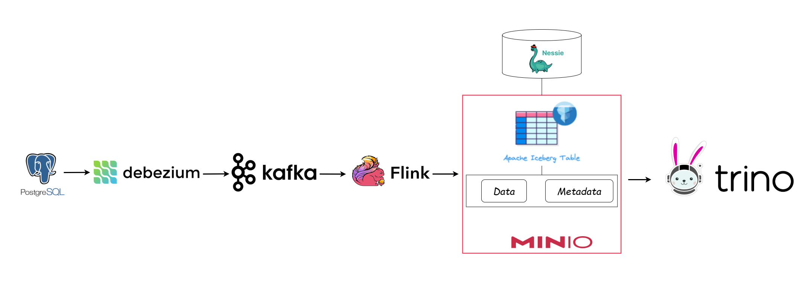

# Data Lakehouse Architecture Overview

The image above represents a modern **Data Lakehouse Architecture** that combines the best of data lakes and data warehouses. This architecture is designed to efficiently manage and analyze data, offering scalability, flexibility, and robust analytics capabilities. 
For detailed installation and testing instructions, please refer to the [Setup and Testing Guide](Steps.md).

Below is a detailed breakdown of each component:

## **1. [PostgreSQL](https://www.postgresql.org/)**
- Serves as the source database for transactional data.
- Manages structured data efficiently, supporting OLTP workloads.
- Acts as the origin for the data pipeline, where changes in the database are captured in real-time.

## **2. [Debezium](https://debezium.io/)**
- A change data capture (CDC) tool that streams real-time changes from PostgreSQL.
- Captures inserts, updates, and deletes, and streams them into a Kafka topic.
- Ensures low-latency data replication for downstream systems.

## **3. [Apache Kafka](https://kafka.apache.org/)**
- A distributed messaging system that handles data ingestion from Debezium.
- Provides high-throughput, fault-tolerant, and scalable data pipelines.
- Acts as a buffer to decouple data producers (Debezium) from consumers (Flink).

## **4. [Apache Flink](https://flink.apache.org/)**
- A powerful stream processing framework used to process real-time data streams.
- Consumes data from Kafka, applies transformations, and writes the data into **Apache Iceberg Tables**.
- Ensures the data is formatted, cleaned, and stored efficiently for analytics.

## **5. [Apache Iceberg](https://iceberg.apache.org/)**
- An open table format designed for managing large-scale analytical data lakes.
- Key features include:
  - **Data Storage**: Stores structured data files in MinIO (object storage).
  - **Metadata Management**: Tracks versions, schemas, and snapshots to support ACID transactions.
- Iceberg tables ensure reliable and high-performance queries across the lakehouse.

## **6. [MinIO](https://min.io/)**
- Acts as the object storage layer in this architecture.
- Stores raw data files and metadata for Apache Iceberg.
- Provides scalability and cost-effectiveness for large-scale data storage.

## **7. [Nessie](https://projectnessie.org/)**
- A data catalog and version control system for Apache Iceberg.
- Allows users to maintain multiple versions of their data for lineage tracking and rollback capabilities.
- Simplifies the management of Iceberg tables in the lakehouse.

## **8. [Trino](https://trino.io/)**
- A distributed SQL query engine used for fast and scalable data analysis.
- Queries the Iceberg tables directly for analytics and reporting.
- Supports interactive queries, data exploration, and advanced analytics with SQL.

---

### **Key Features of This Architecture**
- **Real-time Data Streaming**: Leveraging Debezium, Kafka, and Flink ensures data is updated in near real-time.
- **Scalable and Cost-Effective Storage**: MinIO offers object storage with high availability, making it ideal for massive data lakes.
- **Reliable and Flexible Table Management**: Apache Iceberg provides schema evolution, versioning, and efficient querying.
- **Seamless Analytics**: Trino enables users to perform ad-hoc SQL queries across the data lakehouse without needing data duplication.

---

### **Use Cases**
This architecture is well-suited for:
1. **Real-Time Analytics**: Use cases requiring up-to-date insights from streaming data.
2. **Data-Driven Decision Making**: Unified data lakehouse enables faster decision-making across teams.
3. **Cost-Effective Data Management**: Reduces operational overhead by unifying storage and analytics.

---

This architecture showcases the power of integrating modern open-source tools to build a unified **Data Lakehouse** capable of handling the most demanding analytical workloads.

